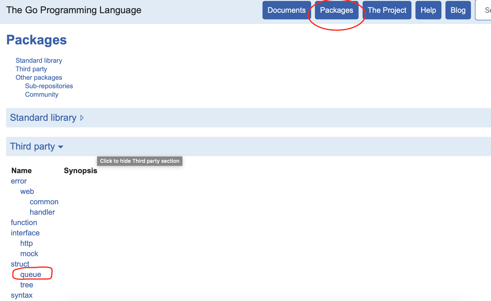
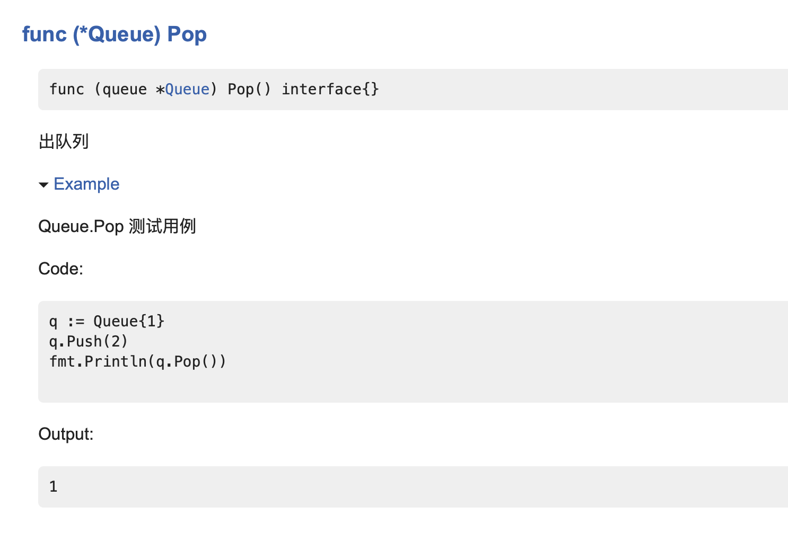

## 测试
Go测试一般使用表格驱动测试

### 测试类
测试类一般与被测试类写在同一个包下，文件名一般以`_test`结尾,单元测试函数以`Test`开头，入参为`*testing.T`

### 性能测试
和单元测试函数一样，只不过是以`Benchmark`开头，入参为`*testing.B`

### 文档测试
Go内置了一个doc功能，而且这个功能和测试结合起来，功能比较强大，有点类似swagger，
一般写完一个函数之后我们需要对其进行单元测试，并且对函数进行文档说明。

比如有一个函数
```go
// 入队列
func (queue *Queue) Push(value interface{}) {
	*queue = append(*queue, value)
}
```
有一个测试类，对这个函数写一个单元测试，函数名以 `Example` 开头，IDE会有提示测哪个函数。
```go
// Queue.Pop 测试用例
func ExampleQueue_Pop() {
	q := Queue{1}
	q.Push(2)
	fmt.Println(q.Pop())

	// Output:
	// 1
}
```
只需要使用 `// Output:` 写上期望的输出值即可。

接下来我们使用 `godoc` 命令来看看这个工具的强大，输入 `godoc -http :6060`,然后打开`http://localhost:6060`即可查看到
所有的文档，包括Go语言官方的，先找一下 `Packages` 下 `Third party`模块



找到`queue`这个包，点击进去找到`Pop`这个函数，可以
看到，注释和测试用例都以文档的形式显示了，这点真的很赞，Go真的是以解决开发实际问题为宗旨的语言。




